# WordPress Hosting Using Docker on AWS EC2

## Introduction

This project demonstrates how to deploy a **WordPress website using Docker containers on an AWS EC2 instance**. The setup uses separate Docker containers for **WordPress** and **MySQL**, allowing easy deployment, scalability, and containerized application management.

The WordPress container communicates with the MySQL container through Docker networking, while AWS Security Groups expose the application to the internet.

---

## Objectives

- Launch an AWS EC2 Instance
- Install Docker on EC2
- Deploy MySQL Container
- Deploy WordPress Container
- Configure Database Connectivity
- Access WordPress from a Browser
- Complete WordPress Installation
- Verify Successful Deployment

---

#  Architecture Diagram

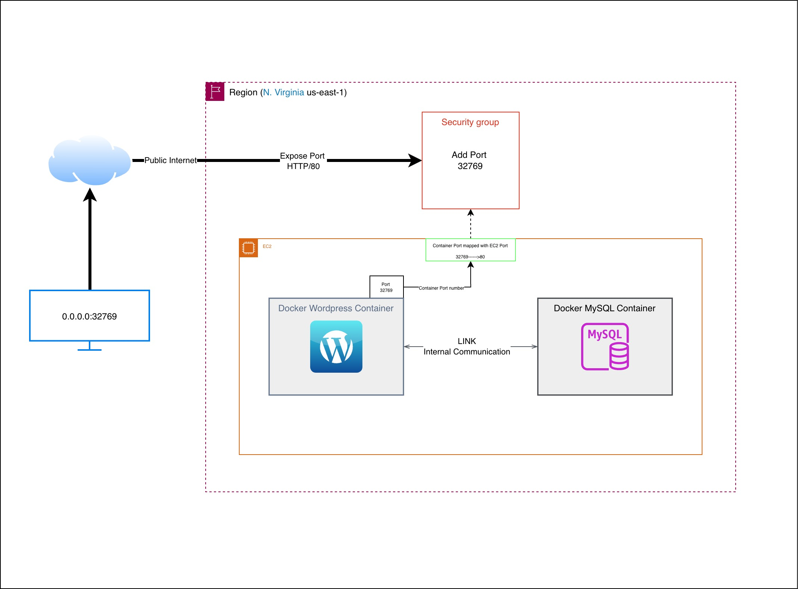

### Architecture Flow

1. User accesses the application through a web browser.
2. AWS Security Group allows inbound traffic on the exposed port.
3. EC2 instance hosts Docker containers.
4. WordPress container runs on port **32769**.
5. Docker maps container port **32769** to host port **80**.
6. WordPress communicates internally with the MySQL container.
7. MySQL stores website data and configuration without exposing to the **Public Internet**.

---

# Prerequisites

- AWS Account
- EC2 Instance (Amazon Linux 2)
- Docker Installed
- Security Group configured
- Internet Connectivity

---

# Step 1: Docker Installation on AWS EC2

## Connect to EC2 Instance

Connect to your EC2 instance using SSH:

```bash
ssh -i <key-pair.pem> ec2-user@<public-ip>
```

---

## Update System Packages

```bash
sudo yum update -y
```

---

## Install Docker

```bash
sudo yum install docker -y
```

---

## Start Docker Service

```bash
sudo systemctl start docker
```

---

## Enable Docker Service at Boot

```bash
sudo systemctl enable docker
```

---

## Verify Docker Status

```bash
sudo systemctl status docker
```

Expected output:

```text
Active: active (running)
```

---

## Add EC2 User to Docker Group

This allows running Docker commands without using sudo.

```bash
sudo usermod -aG docker ec2-user
```

Apply the group changes:

```bash
newgrp docker
```

---

## Verify Docker Installation

Check Docker version:

```bash
docker --version
```

Example Output:

```text
Docker version 28.x.x
```

Run a test container:

```bash
docker run hello-world
```

If the container runs successfully, Docker has been installed correctly.

---

## Verify Docker is Ready

```bash
docker ps
```

Expected output:

```text
CONTAINER ID   IMAGE   COMMAND   CREATED   STATUS   PORTS   NAMES
```

This confirms Docker is installed and ready for deploying containers.

# Step 2: Launch MySQL Container

Run the following command to create a MySQL container:

```bash
docker run -d --name mydb -e MYSQL_ROOT_PASSWORD=root -e MYSQL_DATABASE=wordpressdb mysql
```

### Screenshot


---

# Step 3: Verify MySQL Image Download

Docker automatically pulls the MySQL image from Docker Hub if it is not available locally.

### Screenshot

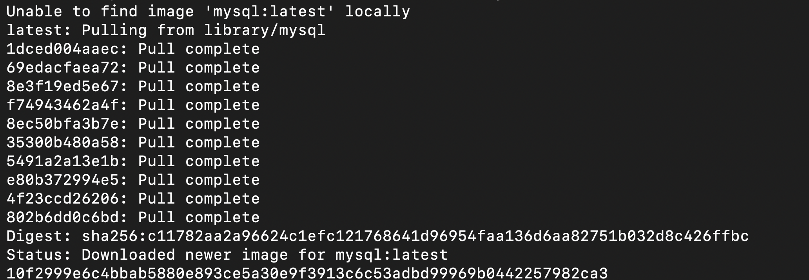

---

# Step 4: Launch WordPress Container

Run the following command to create the WordPress container and connect it with the MySQL container:

```bash
docker run -d -P --name mywordpress -e WORDPRESS_DB_HOST=mydb -e WORDPRESS_DB_USER=root -e WORDPRESS_DB_PASSWORD=root -e WORDPRESS_DB_NAME=wordpressdb --link mydb:mysql wordpress
```

### Screenshot

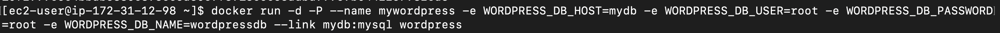

---

# Step 5: Verify WordPress Image Download

Docker downloads the latest WordPress image from Docker Hub.

### Screenshot

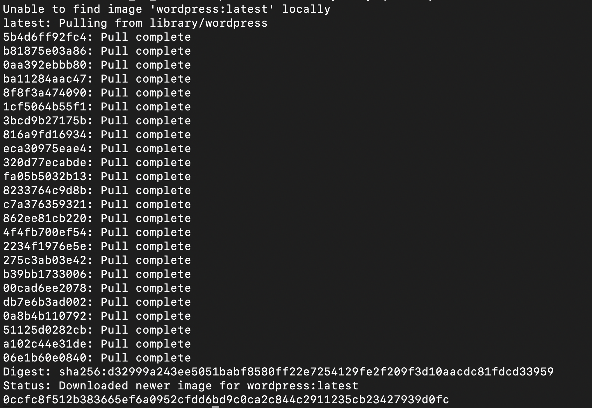

---

# Step 6: Verify Running Containers

Check the status of all running containers:

```bash
docker ps
```

Expected output:

- MySQL container running
- WordPress container running
- WordPress exposed on port 32769

### Screenshot

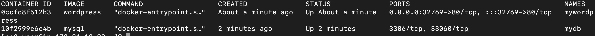

---

# Step 7: Access WordPress Installation Page

Open the browser and access:

```text
http://<EC2-Public-IP>:32769
```

Example:

```text
http://100.55.75.158:32769
```

Select your preferred language and continue.

### Screenshot

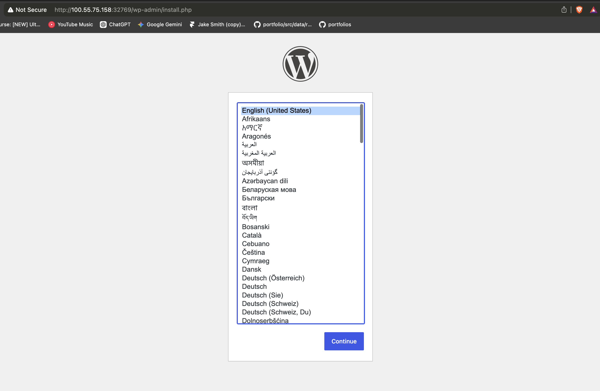

---

# Step 8: Configure WordPress Website

Provide the following information:

- Site Title
- Username
- Password
- Email Address

Click **Install WordPress**.

### Screenshot

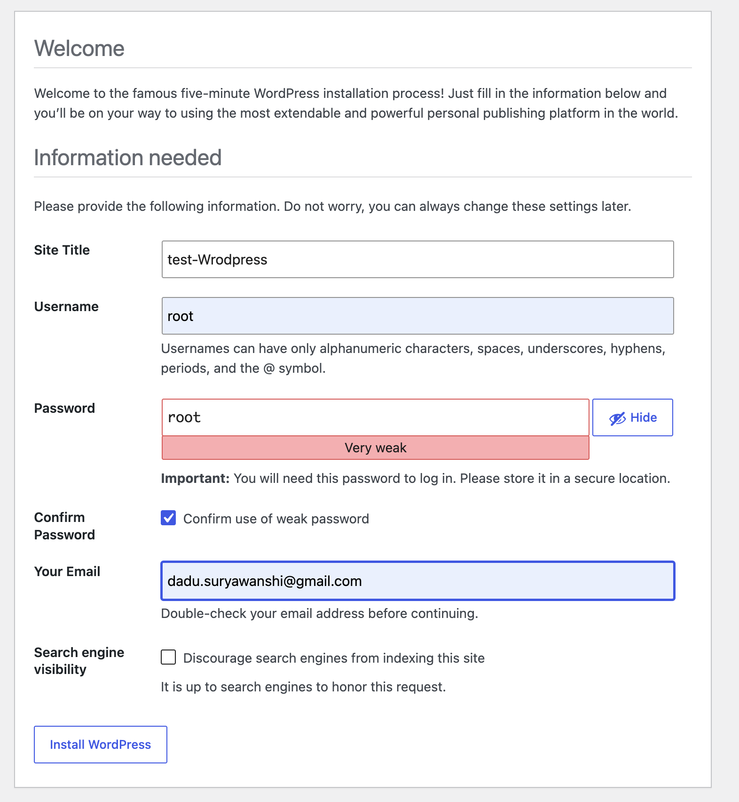

---

# Step 9: WordPress Installation Successful

Once installation completes successfully, WordPress displays a success page.

### Screenshot

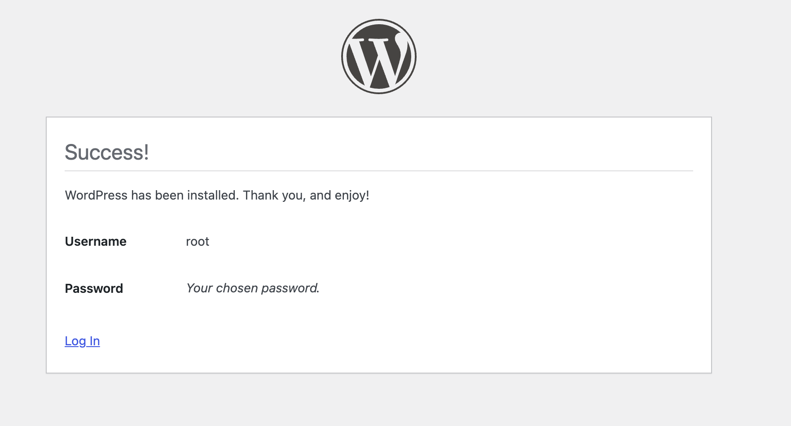

---

# Step 10: Login to WordPress Admin Panel

Use the username and password created during installation.

### Screenshot

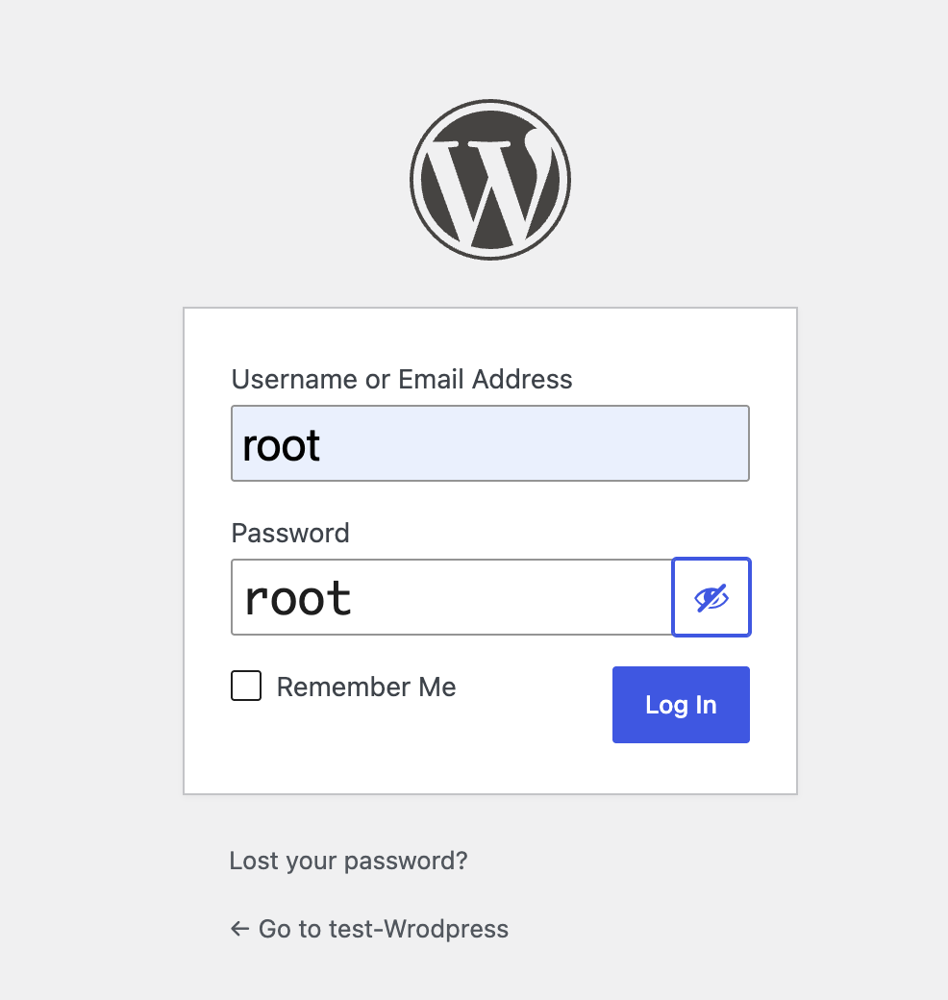

---

# Step 11: Access WordPress Dashboard

After successful login, the WordPress Dashboard becomes available.

### Screenshot

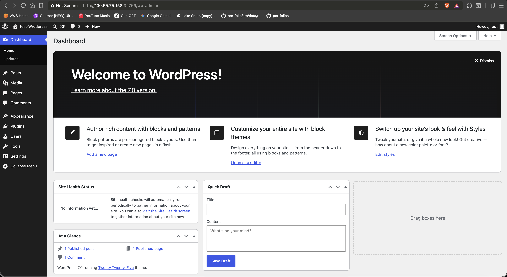

---

# Step 12: View the Website

Click **Visit Site** from the top navigation menu.

### Screenshot

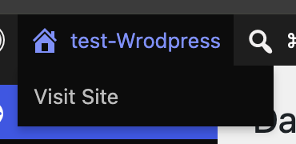

---

# Step 13: WordPress Website Successfully Hosted

The WordPress website is now live and accessible through the browser.

### Screenshot

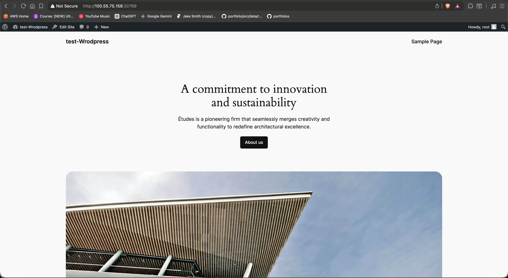

---

# Useful Docker Commands

### View Running Containers

```bash
docker ps
```

### View All Containers

```bash
docker ps -a
```

### Stop Container

```bash
docker stop <container_name>
```

### Start Container

```bash
docker start <container_name>
```

### Remove Container

```bash
docker rm <container_name>
```

### View Docker Images

```bash
docker images
```

---

# Project Outcome

Successfully deployed a containerized WordPress application on AWS EC2 using Docker.

### Achievements

- Installed Docker on AWS EC2

- Created MySQL Container

- Created WordPress Container

- Connected WordPress with MySQL

- Exposed Application to Public Internet

- Completed WordPress Setup

- Verified WordPress Dashboard Access

- Hosted a Live WordPress Website
